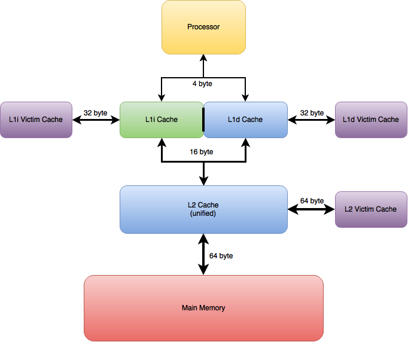

# Cache Simulator


## Important Information
* **Hard Deadline:** 5 pm on Friday, April 29
* traces on eces server `/scratch/arp/ecen4593-sp16`
* **data types:** - very important - signed, unsigned, long int, long long int, etc.
    * any timing statistic - unsigned long long
    * use correct printf format specifier e.g. %llu or %Lu
* on OSX it is necessary to use `zcat < trace_name.gz` to read in traces

## Setup
1. tab size 4
1. spaces rather than hard tabs - avoids alignment issues
1. report written in latex
1. multiple header and .c files grouped by related functions
1. functions documented in doxygen style

    ```C
     /**
      * @brief function description
      * @param[in] x input variable description
      * @param[in,out] y input and output variable description
      * @param[out] z output variable description
      * @return return value description
      */
     ```
3. directory structure
    * `build/` makefile, .o files, executable, config file
    * `config/` contains configuration files used to specify cache memory parameters at runtime
    * `doc/` doxygen related files, pdf of project description
    * `inc/` header files
    * `report/` latex report
    * `report/images` images used in latex report (and any other images e.g. for wiki)
    * `sample_output` correct output files for debugging
    * `sim_results/` all txt files of simulation results - folder is ignored for now
    * `src/` source files
    * `test/` unit test files - uses check framework
    * `traces/` gzipped traces for debugging

## Deliverables
1. printouts of simulator code
1. outputs of simulations
    1. 6 production traces * 9 memory configurations = 54 total
1. plots of all simulation results
1. commentary on simulation results - "several pages"
1. Additional simulation - sjeng trace only
    1. use default config
    1. run simulations increasing main memory bandwidth by powrs of 2
    1. run for 8, 16, 32, 64
    1. create plots of performance vs. cost
    1. discuss best main memory system model
    1. discuss effects of bandwidth on overall system performance
1. submit hard copy of report
1. submit cd or usb of code and simulation results
